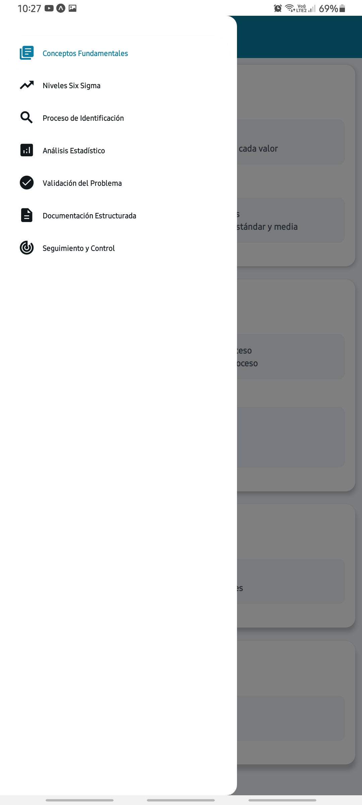
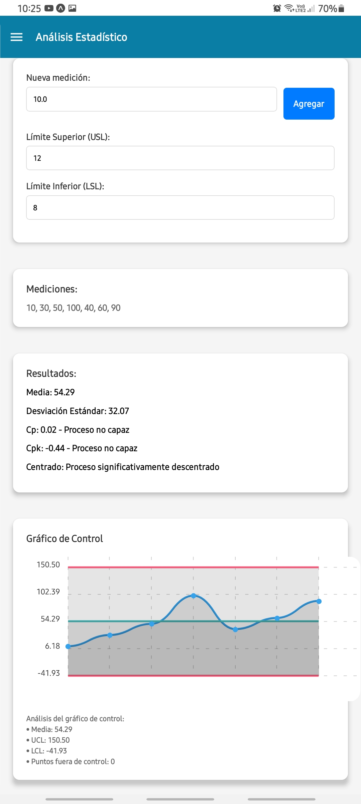
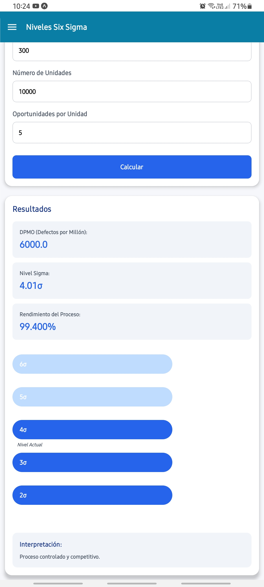
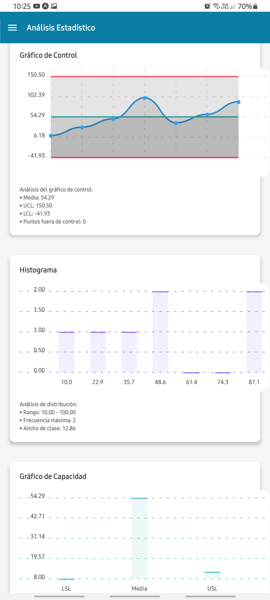
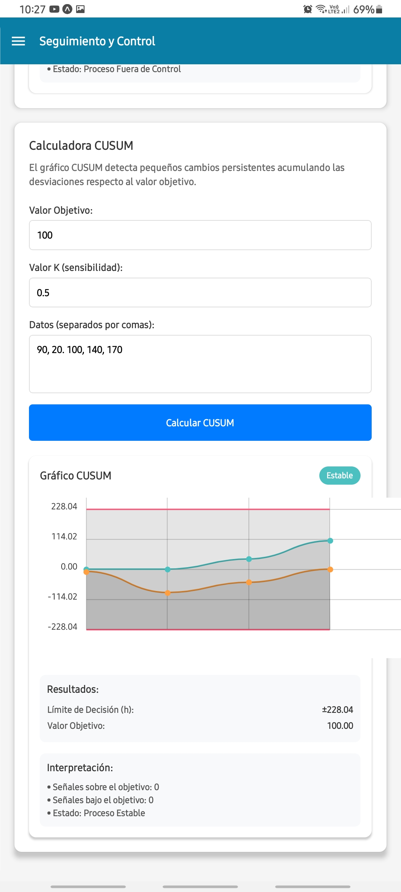
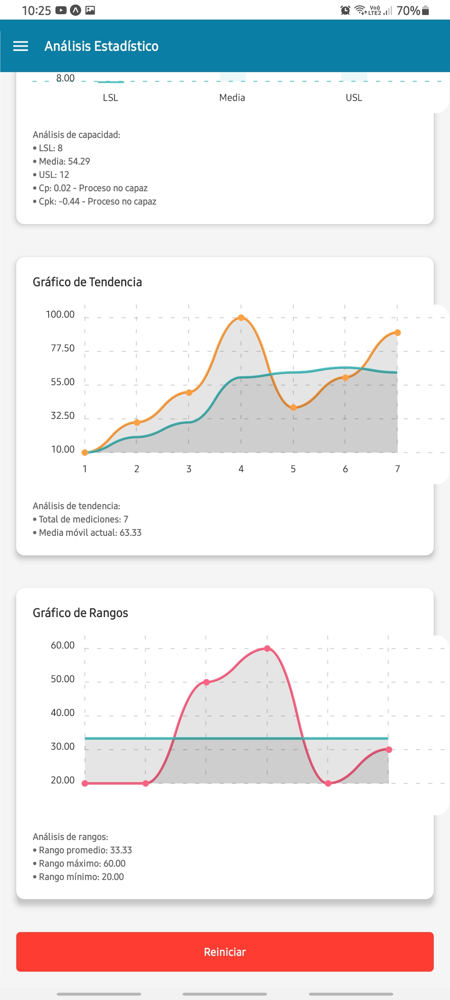

# Welcome to Six-Sigma App 👋

Six-Sigma is an application designed to assist in the statistical analysis of processes in the **Six Sigma** cycle. It allows real-time tracking and analysis of data, identifying areas for improvement, and optimizing processes using advanced statistical techniques.

The app is focused on helping businesses reduce process variability, improve quality, and increase operational efficiency through the use of statistical tools.

## 🎯 Objective

The goal of the **Six-Sigma** app is to help users implement and monitor the phases of the Six Sigma process, including:

- **Define** the problem and objectives.
- **Measure** the process performance.
- **Analyze** the collected data.
- **Improve** the process based on findings.
- **Control** the results to ensure continuous improvement.

## 📱 Preview

### Dashboard
Here's a look at the **main dashboard** of the app, where you can view the analyzed data and process results:



### Functionality

#### Step 1: Data Input
The app allows you to input process data for performance analysis:



#### Step 2: Statistical Analysis
Once the data is entered, the app generates statistical analysis to help identify areas for process improvement:







---

## Get Started

Follow these steps to install and get started with the app.

1. **Install dependencies**

   First, make sure you have **Node.js** and **npm** installed. Then, install the necessary dependencies by running the following command in the terminal:

   ```bash
   npm install
